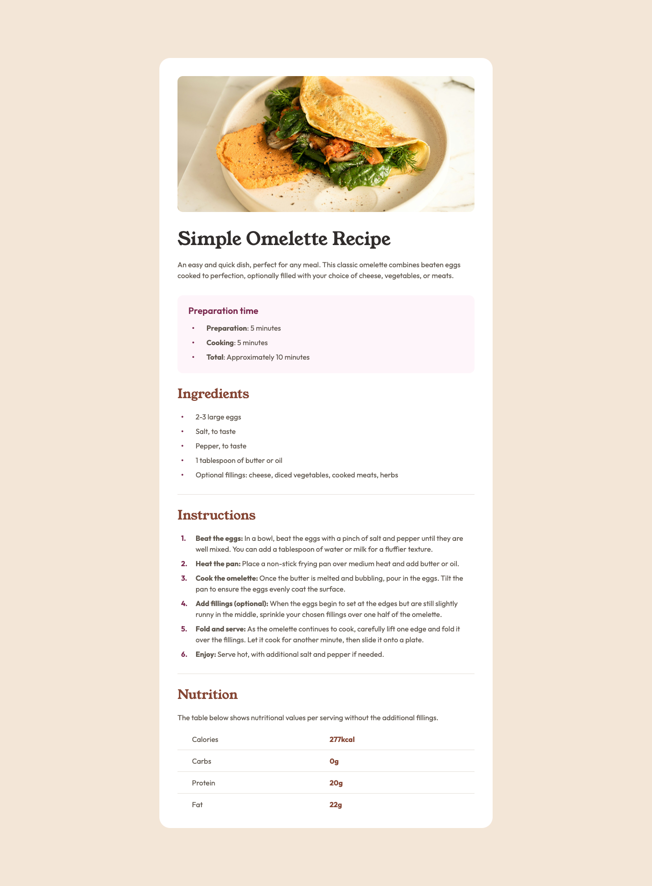

# Frontend Mentor - Recipe page solution

This is a solution to the [Recipe page challenge on Frontend Mentor](https://www.frontendmentor.io/challenges/recipe-page-KiTsR8QQKm). Frontend Mentor challenges help you improve your coding skills by building realistic projects. 

## Table of contents

- [Overview](#overview)
  - [The challenge](#the-challenge)
  - [Screenshot](#screenshot)
  - [Links](#links)
- [My process](#my-process)
  - [Built with](#built-with)
  - [What I learned](#what-i-learned)
  - [Continued development](#continued-development)
  - [Useful resources](#useful-resources)
- [Author](#author)

## Overview

### The challenge

The challenge is to build out this recipe page and get it looking as close to the proivded design as possible.

You can use any tools you like to help you complete the challenge. So if you've got something you'd like to practice, feel free to give it a go.

Ideas to test yourself:

- Do your research on various HTML elements and ensure you use the most appropriate element based on the content.
- Train your eye for detail by getting your solution to look similar to the design.

### Screenshot



### Links

- Solution/Live Site URL: [https://cocoelizabeth.github.io/frontendmentor-recipe-page/](https://cocoelizabeth.github.io/frontendmentor-recipe-page/)

## My process

### Built with

- Semantic HTML5 markup
- CSS custom properties
- Flexbox
- CSS Grid
- Mobile-first workflow

### What I learned

Through this project, I gained a lot of experience in creating customized list styles using CSS, and specifically by leveraging CSS counters for ordered lists. 

Since all of the lists in the project (Preparation time, Ingredients, and Instructions) had many properties in common (i.e. layout, size, padding, etc), I was able to structure the HTML lists uniformly and apply a custom, reusable class, `.list`, to all `<ol>` and `<ul>` list elements within the project.

Here's how the HTML structure was standardized:


```html
<!-- For numbered lists -->
<ol class="list custom-ol">
  <li class="text-preset-4 m-b-100"><span>List Item Text</span></li>
  <!-- Additional list items -->
</ol>

<!-- For bulleted lists -->
<ul class="list custom-ul">
  <li class="text-preset-4 m-b-100"><span>List Item Text</span></li>
  <!-- etc. -->
</ul>
```

In my CSS, I removed default list styling in my `css-reset.css`, and the `.list` class that I created in my `styles.css` defined the consistent base styles for all lists.
```css
/* styles.css */
.list {
    margin: 0;
    padding: 0;
    width: 100%;

    li {
        display: flex;
        width: 100%;
    }

    li::before {
        font-weight: bold;
        color: var(--color-rose-800);
        height: 100%;
        min-width: var(--spacing-500);
        padding-left: 8px;
        padding-right: 8px;
        box-sizing: border-box;
    }
}

/* css-reset.css */
ol,
ul {
  list-style: none;
}
```

For ordered lists, I created a class called `.custom-ol` and used the `counter-reset` and `counter-increment` properties to number each item uniquely. I also used the `content` property to append a period after each number.

```css
.custom-ol {
    counter-reset: css-counter;

    li {
        counter-increment: css-counter;
    }

    li::before {
        content: counter(css-counter) ".";
    }
}

```

For the unordered lists, I created a class called `.custom-ul`, and adjusted the  `content` to  property to display a bullet point. I also utilized Flexbox by adding  `align-items: center;` to ensure that the bullets were centered vertically to each block of text.

```css
.custom-ul {

    li {
        align-items: center;
    }
    
    li::before {
        content: "•";
    }
}
```

### Continued development

I want to continue focusing on writing semantic HTML and CSS in future projects. 

### Useful resources

- [CSS Tricks | Using CSS Counters for Custom List Number Styling](https://css-tricks.com/css-counters-custom-list-number-styling/) - This helped me learn how to add custom styling to my lists and especially helped learn about CSS Counters.
- [Flexbox Froggy](https://flexboxfroggy.com/) - This is a fun, interactive game for learning CSS Flexbox.
- [Grid Garden](https://cssgridgarden.com/) - This is a fun, interactive game for learning CSS Grid.

## Author

<!-- - Website - [Add your name here](https://www.your-site.com) -->
- Frontend Mentor - [@cocoelizabeth](https://www.frontendmentor.io/profile/cocoelizabeth)
<!-- - Twitter - [@yourusername](https://www.twitter.com/yourusername) -->

